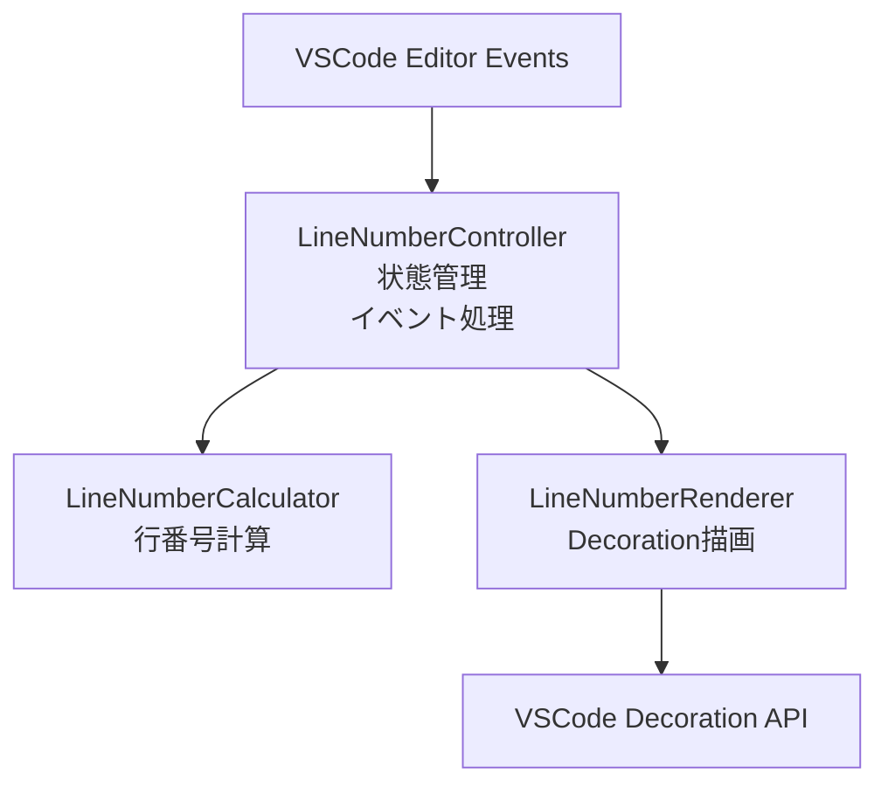

## Architecture

```mermaid
flowchart TD

VSCode["VSCode Editor Events"]

VSCode --> Controller

Controller["LineNumberController
状態管理
イベント処理"]

Controller --> Calculator
Controller --> Renderer

Calculator["LineNumberCalculator
行番号計算"]

Renderer["LineNumberRenderer
Decoration描画"]

Renderer --> VSCodeAPI["VSCode Decoration API"]
```