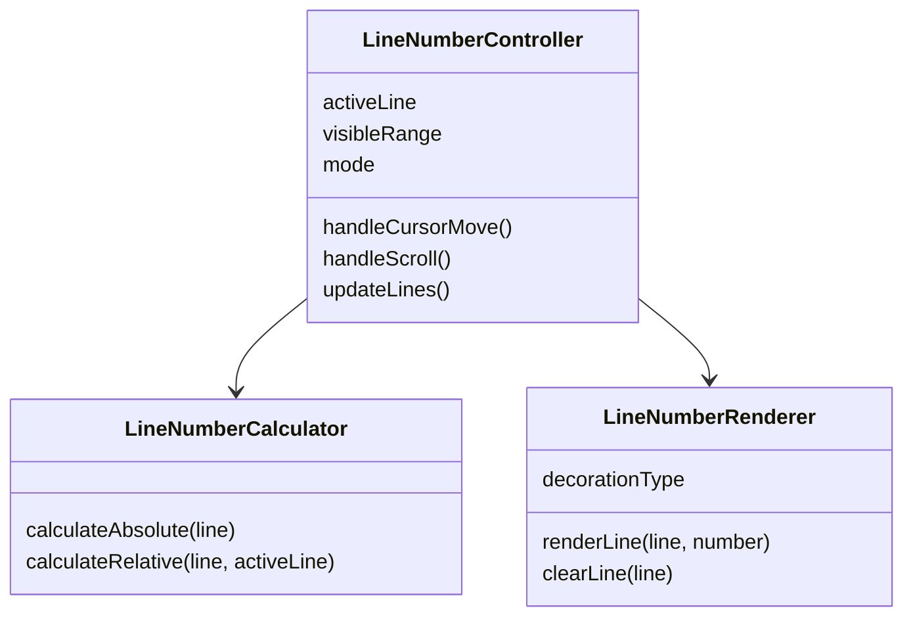

## Class Design

```mermaid
classDiagram

class LineNumberController {
  activeLine
  visibleRange
  mode
  handleCursorMove()
  handleScroll()
  updateLines()
}

class LineNumberCalculator {
  calculateAbsolute(line)
  calculateRelative(line, activeLine)
}

class LineNumberRenderer {
  decorationType
  renderLine(line, number)
  clearLine(line)
}

LineNumberController --> LineNumberCalculator
LineNumberController --> LineNumberRenderer
```