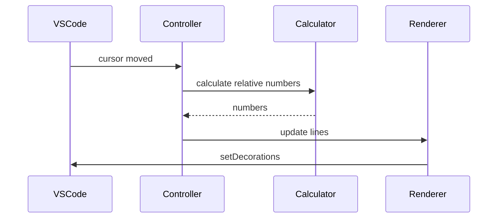

## Diagram 

```mermaid
sequenceDiagram

participant VSCode
participant Controller
participant Calculator
participant Renderer

VSCode ->> Controller: cursor moved
Controller ->> Calculator: calculate relative numbers
Calculator -->> Controller: numbers
Controller ->> Renderer: update lines
Renderer ->> VSCode: setDecorations
```